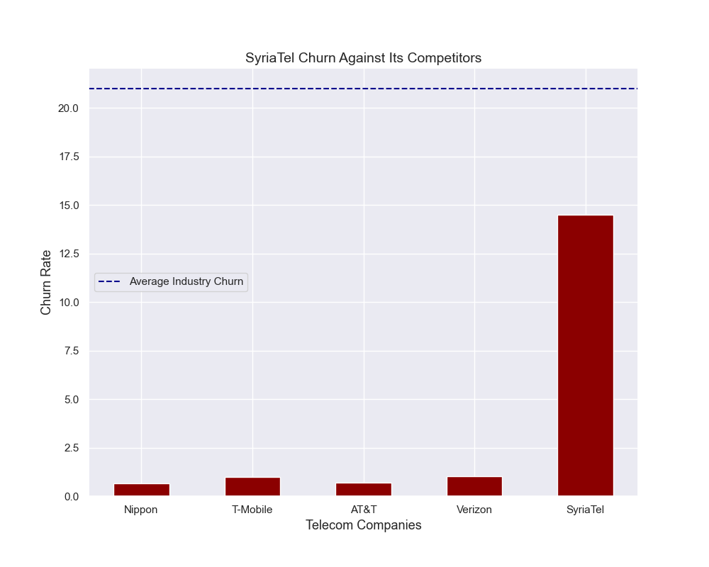

# SyriaTel Churn

Samantha Baltodano

## Table of Contents
* [Overview](#overview)
* [Business Understanding](#business-understanding)
* [Method](#method)
* [Analysis](#analysis)
* [Recommendations](#recommendations)
* [Contributors](#contributors)

## Repository Links
* [Data](/Data)
* [Images](/Visuals)

## Overview
For this project I evaluated a dataset of 20 attributes and 3333 rows containing SyraTel's churn metrics. I outline my process of identifying the top indicators of churn and creating machine learning model to predict whether or not a client will soon churn. I was able to create several machine learning classification models and compare their performance on unseen data to decide on a final predictive model that SyriaTel could deploy on their current client database. My final models utilized `sklearns` Decision Tree Classifier and the Gradient Boost.

## Business Understanding

SyriaTel is a national telecommunications company interested in reducing churn by identifying which clients will ‘soon’ stop doing business with their company. In the telecom industry, it costs [5 times](https://towardsdatascience.com/customer-churn-in-telecom-segment-5e49356f39e5) as much to acquire new business than it does to maintain existing clients. To determine what a good churn rate for a telecom company is, I have compared the telecom churn with the churn rates from four of the [top telecom companies](https://www.investopedia.com/articles/markets/030216/worlds-top-10-telecommunications-companies.asp) in the United States, AT&T, Verizon, T-Mobile, and Noppio, as well as comparing the SyriaTel churn against the [industry average](https://www.statista.com/statistics/816735/customer-churn-rate-by-industry-us/).

It is clear that SyriaTel is beating the industry average, but compared to their top competitors, SyriaTel has a long way to go in terms of churn reduction. It is known that the number one cause for churn in the telecom industry is [customer service] (http://www.dbmarketing.com/telecom/churnreduction.html), so as I examine the attributes in my dataset, I will look for attributes that may be indicators of client dissatisfaction.

## Method

This objective will be achieved by first assessing feature importance on the below attributes and determining which tend to be the strongest predictors of churn.

I will then apply these attributes to several classification machine learning models to classify at risk clients presently and in the future. 

The final step will ultimately be the launch of a final program on existing clients.

#### Treating Type Errors
In dealing with type errors moving forward, type 2 errors pose the highest threat to SyriaTel’s company. Ideally, we will find a balance between the two type errors, but if that is not attainable, we are better off reducing type 2 errors despite the fact that it will lead to a subsequent increase in type 1 errors. In this case, a false positive (assuming a client will churn when they will not) is preferrable to a false negative (assuming that a client will not churn when they actually will).

## Analysis
Using a Pearson's correlation, I was able to identify that the following features had the biggest impact on churn.
* `customer_service_calls` - the number of calls a client made to the customer service line
* `total_spend` - how much a client was charges for all phone call categories (international, evening, night, and day)
* `total_day_charge` - charges for day calls

From my deep dive into the * `customer_service_calls` attribute, I learned that 80% of all customers made at least one call to the customer service line, and customers who made 4 or more calls to the customer service line are 52% likely to churn. That portion of clients making 4 and more calls account for 28% of the total churned clients. By addressing just this portion of clients, we could potentially reduce churn by up to 4%.

Additionlly, price has an outsized impact on customer churn. 74% of clients getting charged $75 and up will churn. Alarmingly, the clients who are using SyriaTel's services the most are the least satisfied. 

After a further look into the breakdown of charges, I discovered that 99.9% of all clients make day time phone calls and 52% of all phone call charges come from day calls. Clients spending $40 or more are more likely to churn.

## Recommendations

Based on my feature analysis and the results from my final machine learning program, it is clear that customer service calls and day call charges have the strongest impact on customer satisfaction. SyriaTel can do the following to reduce churn:

1) Track metrics from customer service calls. Are clients calling about the same issues? Are these issues with billing? Service? Once we know why these clients are calling we can better alleviate their pain by addressing and correcting these issues.

2) Re-evaluate pricing structure for day calls. Consider a tiered pricing structure past a certain dollar amount 

After implementing the model onto our current database of clients, I would reccommend reaching out to the 'likely to churn' clients individually and discussing their experience with the company and identifying their pain points.

## Final Model

As a final model, I would recommend either the Gradient Boost or the Decision Tree Classifier. The final Gradient Boost model had a higher accuracy overall at 94% with a recall of 74%. On the other hand, the best Decision Tree Classifier had a lower accuracy of 90%, but a higher recall at 83%. Based on my initial recommendations to reduce type 2 errors, the best Decision Tree Classifier my be a better fit.

## Contributors
- Samantha Baltodano  
    Github: [sbaltodano](https://github.com/sbaltodano) 